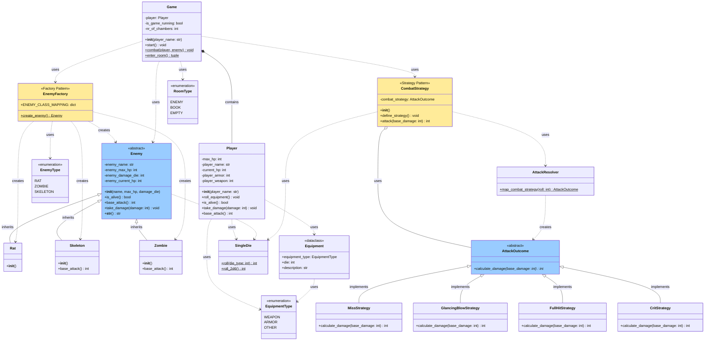

# Diagram Klas - The Temple of The Nameless Goddess

## Diagram w notacji Mermaid



## Legenda

### Wzorce projektowe:
- **Factory Pattern** (żółty) - `EnemyFactory` do tworzenia wrogów
- **Strategy Pattern** (żółty) - `CombatStrategy` do obliczania obrażeń

### Typy klas:
- **Klasy abstrakcyjne** (niebieski) - `Enemy`, `AttackOutcome`
- **Klasy konkretne** (biały) - implementacje wzorców
- **Enumeracje** - `EnemyType`, `RoomType`, `EquipmentType`
- **Dataclass** - `Equipment`

### Relacje:
- **Dziedziczenie** (△──) - Rat, Skeleton, Zombie dziedziczą po Enemy
- **Kompozycja** (◆──) - Game zawiera Player
- **Agregacja** (◇──) - CombatStrategy używa AttackOutcome
- **Zależność** (╌╌>) - klasa używa innej klasy

## Opis wzorców

### 1. Factory Pattern (`EnemyFactory`)
**Cel:** Centralizacja tworzenia obiektów wrogów.

**Implementacja:**
- Klasa bazowa `Enemy` (abstrakcyjna)
- Konkretne implementacje: `Rat`, `Skeleton`, `Zombie`
- Fabryka `EnemyFactory` z metodą `create_enemy()`
- Mapowanie typów przez słownik `ENEMY_CLASS_MAPPING`

**Zalety:**
- Łatwe dodawanie nowych typów wrogów
- Spójność tworzenia obiektów
- Oddzielenie logiki tworzenia od logiki gry

### 2. Strategy Pattern (`AttackOutcome`)
**Cel:** Dynamiczne wybieranie algorytmu obliczania obrażeń.

**Implementacja:**
- Interfejs `AttackOutcome` (abstrakcyjna klasa bazowa)
- Konkretne strategie: `MissStrategy`, `GlancingBlowStrategy`, `FullHitStrategy`, `CritStrategy`
- Kontekst `CombatStrategy` przechowujący wybraną strategię
- Resolver `AttackResolver` mapujący rzut kości na strategię

**Zalety:**
- Brak wielokrotnych instrukcji warunkowych
- Łatwe dodawanie nowych typów ataków
- Kod zgodny z zasadą Open/Closed (otwarty na rozszerzenia, zamknięty na modyfikacje)

## Przepływ danych

1. **Inicjalizacja gry:**
   ```
   main() → Game(player_name) → Player(player_name) → roll_equipment()
   ```

2. **Wejście do pokoju:**
   ```
   Game.enter_room() → SingleDie.roll(6) → ROOM_TABLE → RoomType
   ```

3. **Tworzenie wroga (Factory Pattern):**
   ```
   EnemyFactory.create_enemy() → roll(6) → ENEMY_TABLE → EnemyType
   → ENEMY_CLASS_MAPPING[type]() → Rat/Skeleton/Zombie
   ```

4. **Walka (Strategy Pattern):**
   ```
   CombatStrategy.define_strategy() → roll_2d6() → AttackResolver
   → map_combat_strategy(roll) → MissStrategy/GlancingBlowStrategy/etc.
   → attack(base_damage) → combat_strategy.calculate_damage()
   ```
