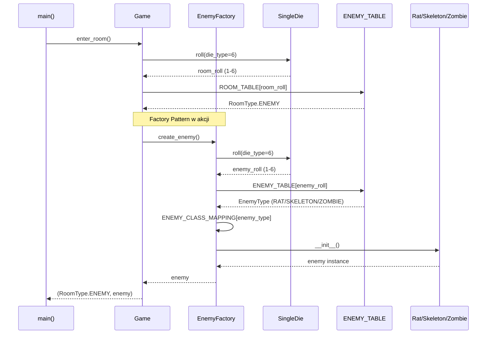
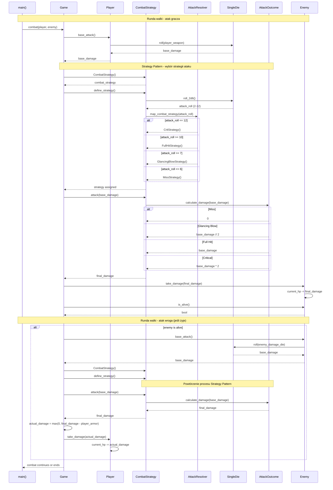
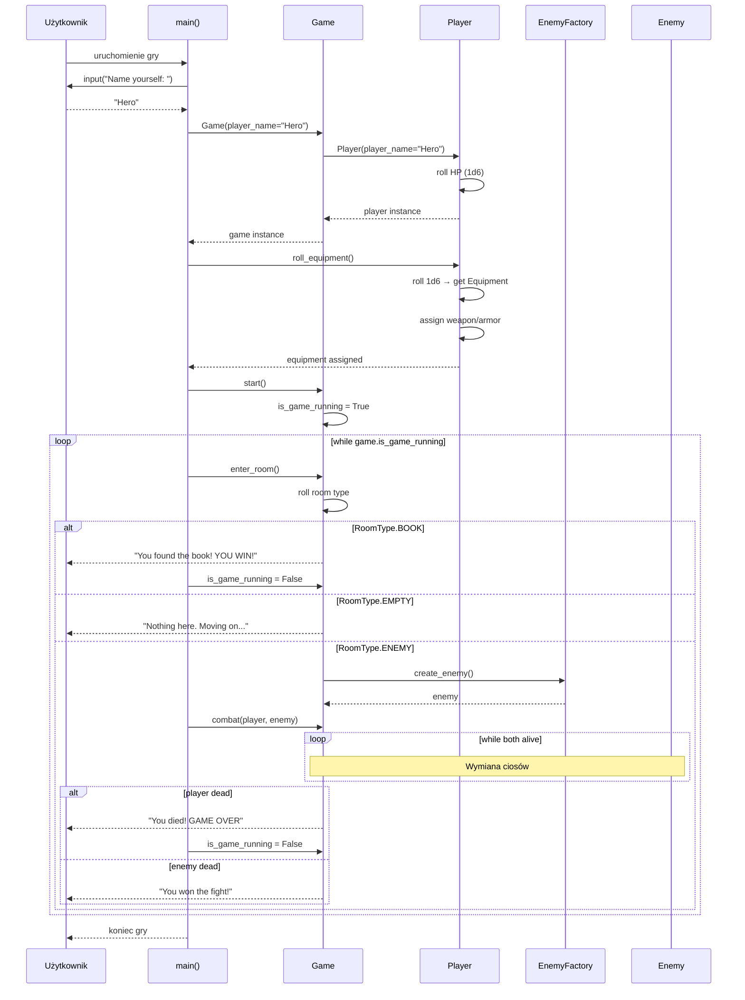

# Diagramy Sekwencji - The Temple of The Nameless Goddess

## 1. Diagram sekwencji - Tworzenie wroga (Factory Pattern)

## 2. Diagram sekwencji - Walka (Strategy Pattern)

## 3. Diagram sekwencji - Pełny przebieg gry

## Kluczowe obserwacje

### Factory Pattern (Diagram 1)
1. **Separacja odpowiedzialności**: `Game` nie musi wiedzieć, jak tworzyć konkretne typy wrogów
2. **Jednolity interfejs**: `create_enemy()` zawsze zwraca obiekt typu `Enemy`
3. **Losowość kontrolowana**: Fabryka używa `SingleDie` i `ENEMY_TABLE` do losowania typu

### Strategy Pattern (Diagram 2)
1. **Dynamiczny wybór**: Strategia wybierana w runtime na podstawie rzutu 2d6
2. **Brak if-else**: Zamiast wielu warunków, używamy polimorfizmu
3. **Reużywalność**: Ta sama strategia dla gracza i wroga
4. **Separation of concerns**: `CombatStrategy` odpowiada za wybór, `AttackOutcome` za kalkulację

### Przepływ gry (Diagram 3)
1. **Inicjalizacja**: Tworzenie gracza i losowanie ekwipunku
2. **Pętla główna**: Eksploracja pokoi aż do wygranej lub śmierci
3. **Warunki końcowe**: Znalezienie książki (wygrana) lub śmierć gracza (przegrana)
